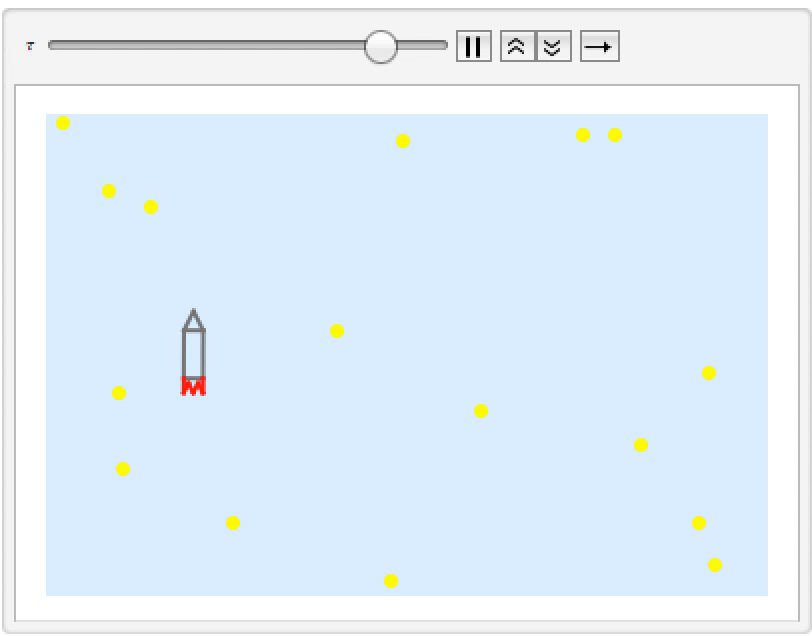

# ME 454 Optimal Control Project

This was my project in ME 454 Class. I modeled Thrust-Vectored Hovering Rocket and use Linear Quadratic Regulator to solve optimal control of given non-linear system using simple gradient descent.

- Details of the system is in `pdf` file
- Mathematica notebook is attached (with simulation section)

## Example of simple desired trajectory

